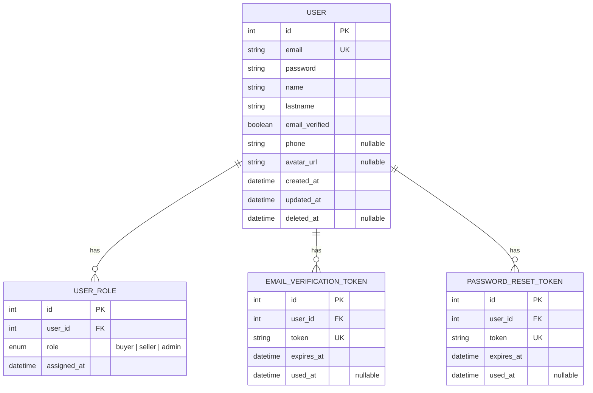

# 03 — Modelos de Datos

## Diagrama Entidad-Relación (Prisma)



## Entidad User

### Campos
| Campo | Tipo | Requerido | Descripción |
|---|---|---|---|
| `id` | Int (PK) | Auto | Identificador único |
| `email` | String | Sí | Email único en el sistema |
| `password` | String | Sí | Hash bcrypt de la contraseña |
| `name` | String | Sí | Nombre del usuario |
| `lastname` | String | Sí | Apellido del usuario |
| `email_verified` | Boolean | Default `false` | Indica si el email fue verificado |
| `phone` | String? | No | Teléfono (7-15 dígitos) |
| `avatar_url` | String? | No | Ruta relativa del avatar |
| `created_at` | DateTime | Auto | Fecha de creación |
| `updated_at` | DateTime | Auto | Última modificación |
| `deleted_at` | DateTime? | No | Soft delete (`null` = activo) |

### Relaciones
- **User → UserRole**: 1:N (un usuario puede tener múltiples roles)
- **User → EmailVerificationToken**: 1:N
- **User → PasswordResetToken**: 1:N

### Reglas de negocio
- **Soft delete**: nunca se borran físicamente. Todas las consultas filtran `deleted_at IS NULL`.
- **Email único**: incluso usuarios eliminados (soft delete) ocupan su email — no se puede registrar un email ya existente.
- **Password**: nunca se devuelve en respuestas. Solo se almacena hasheada.
- **Rol por defecto al registrarse**: `buyer`.

## Entidad UserRole

### Campos
| Campo | Tipo | Requerido | Descripción |
|---|---|---|---|
| `id` | Int (PK) | Auto | Identificador único |
| `user_id` | Int (FK) | Sí | Referencia al usuario |
| `role` | Enum | Sí | `buyer`, `seller` o `admin` |
| `assigned_at` | DateTime | Auto | Fecha de asignación |

### Restricciones
- `@@unique([user_id, role])` — un usuario no puede tener el mismo rol dos veces.

### Estados posibles de roles
- `buyer` — Comprador de tickets
- `seller` — Vendedor de tickets
- `admin` — Acceso completo al sistema

### Reglas de negocio
- Al registrarse, se asigna automáticamente el rol `buyer`.
- Un usuario puede tener múltiples roles simultáneamente (ej: buyer + seller).
- No se puede asignar un rol que el usuario ya posee (`409 Conflict`).

## Entidad EmailVerificationToken

### Campos
| Campo | Tipo | Requerido | Descripción |
|---|---|---|---|
| `id` | Int (PK) | Auto | Identificador único |
| `user_id` | Int (FK) | Sí | Referencia al usuario |
| `token` | String (UK) | Sí | Token UUID único |
| `expires_at` | DateTime | Sí | Fecha de expiración (24h desde creación) |
| `used_at` | DateTime? | No | Fecha de uso (`null` = no usado) |

### Reglas de negocio
- El token se genera como UUID aleatorio.
- Expira en 24 horas.
- Si el token expiró, se puede reenviar uno nuevo (el anterior se invalida).
- Al verificar el email, `email_verified` pasa a `true` y `used_at` se marca con la fecha actual.

## Entidad PasswordResetToken

### Campos
| Campo | Tipo | Requerido | Descripción |
|---|---|---|---|
| `id` | Int (PK) | Auto | Identificador único |
| `user_id` | Int (FK) | Sí | Referencia al usuario |
| `token` | String (UK) | Sí | Token UUID único |
| `expires_at` | DateTime | Sí | Fecha de expiración (1h desde creación) |
| `used_at` | DateTime? | No | Fecha de uso (`null` = no usado) |

### Reglas de negocio
- Se genera como UUID aleatorio.
- Expira en 1 hora.
- Al solicitar un nuevo token, los anteriores del mismo usuario se invalidan (`used_at = now()`).
- No se revela si el email existe en `forgot-password` (seguridad).

## Mapa de Tipos TypeScript (espejo del backend)

```typescript
// Enums
type UserRole = 'buyer' | 'seller' | 'admin';

// Entidades
interface User {
  id: number;
  email: string;
  name: string;
  lastname: string;
  roles: UserRole[];
  email_verified: boolean;
  phone: string | null;
  avatar_url: string | null;
  created_at: string;  // ISO 8601
  updated_at: string;  // ISO 8601
  deleted_at: string | null;
}

// Requests
interface RegisterRequest {
  email: string;
  password: string;
  name: string;
  lastname: string;
  phone?: string;
}

interface LoginRequest {
  email: string;
  password: string;
}

interface UpdateProfileRequest {
  name?: string;
  lastname?: string;
  phone?: string;
}

interface AddRoleRequest {
  role: UserRole;
}

interface ForgotPasswordRequest {
  email: string;
}

interface ResetPasswordRequest {
  token: string;
  new_password: string;
}

// Responses
interface TokenResponse {
  access_token: string;
  token_type: string;
  expires_in: number;
}

interface ApiError {
  detail: string | ValidationErrorDetail[];
}

interface ValidationErrorDetail {
  loc: string[];
  msg: string;
  type: string;
}
```

## Lifecycle del Usuario

```
Registro (email_verified = false, role = buyer)
    │
    ├── Verificar email (email_verified = true)
    │       │
    │       ├── Login exitoso → JWT
    │       │       │
    │       │       ├── Editar perfil
    │       │       ├── Subir avatar
    │       │       ├── Añadir rol (seller)
    │       │       └── Logout (descartar token)
    │       │
    │       └── Olvidé contraseña → Reset password
    │
    └── Reenviar verificación (si expiró o no llegó)
```
